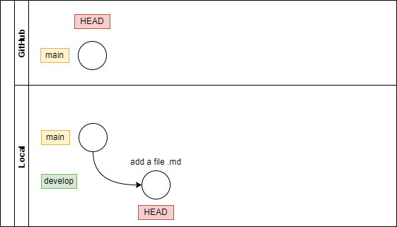
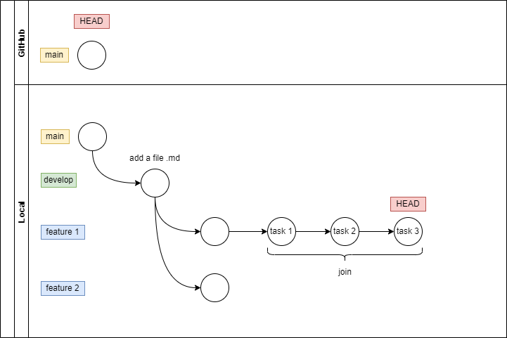
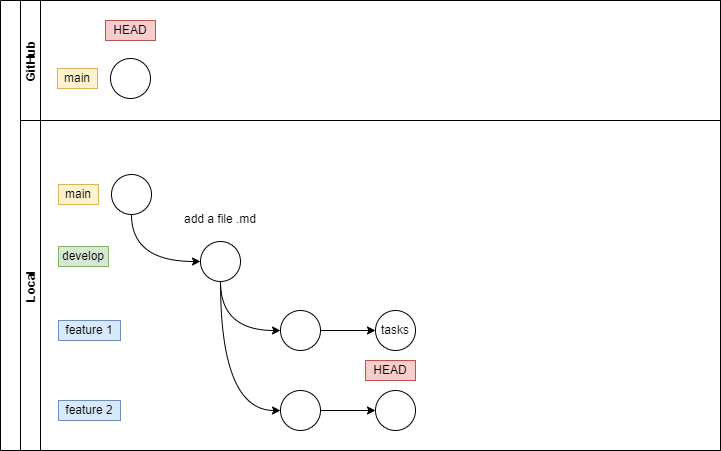
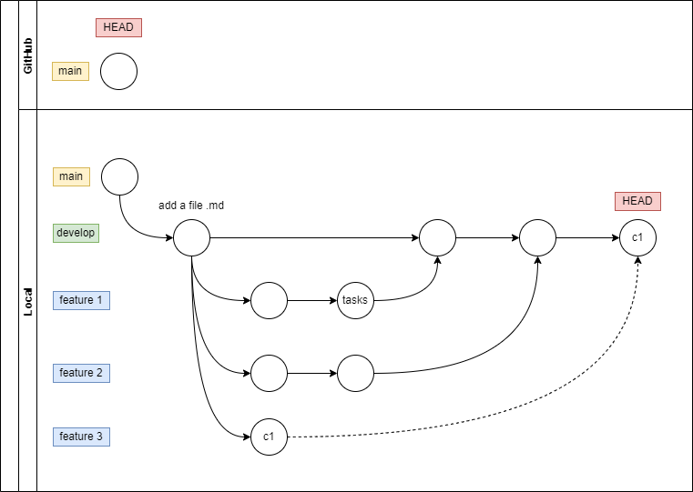
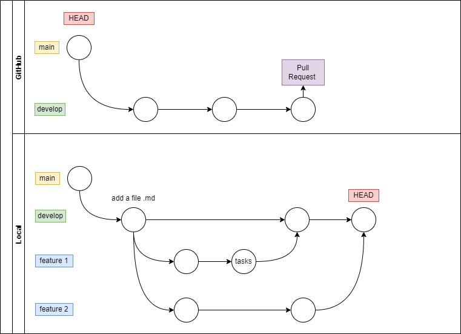

# GIT-Nerdery-Challenge

 

 
First, add user name and email in git config local for this repository

1. Fork the Assignment repository on GitHub

2. Clone the repository on your local machine

 

3. Create a new branch called develop

4. Checkout develop branch

   I. Create a file called “blog.md” and add some description on file (maybe your name or something else)

   II.commit the changes
   

 

5. Create a new branch called “feature1”

   I. Add a one subtitle and link to “blog.md” file

   II. Commit the changes into this branch

   III. Add a subtitle 2 and text to blog.md and commit (task 1)

   IV. Add a subtitle 3 and text to blog.md and commit (task 2)

   V. Add a subtitle 4 and text to blog.md and commit (task 3)

   VI. Join 3 tasks commits

 
 

6. Now, from the develop branch you must create a new branch called “feature2”
   I. Add other subtitle and a image in blog.md
   II. Commit the changes
   

 

7. Merges
   I. Go to “develop” branch and merge with “feature1”
   II. Then merge with feature2 and solve possible conflicts
   

 

8. Now, create a new branch called “feature3” from develop branch

   I. Create a new file

   II. Add some content on the new file created.

   III. Create a commit into this branch.

   IV. Use cherry pick to move the commit into develop branch.

 
 

9. Do git reflog

   I.Take screenshots of the result.

   II.Attach the screenshot to the main directory of the repository

   III.Do commit before pushing your changes.

10. Push features and develop branch

11. Make a PR from develop to main branch ( to the initial repository that you fork initially)

 

